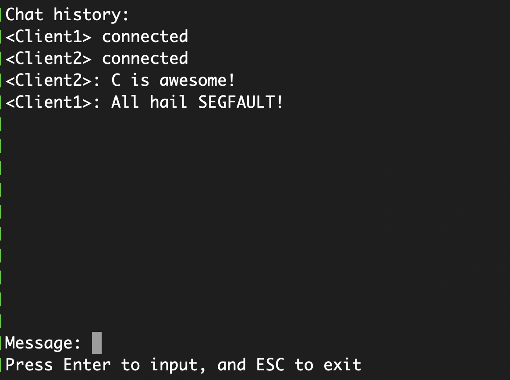

# TCP chat room in C

## Description
This project serves as a practical exploration of TCP socket programming. Uses POSIX 'sys/socket.h', therefore works only on Posix systems. 
The recent implementation is housed in the `chat/` directory, with an older version (`old_implementation`) retained for reference. A key distinction is that the earlier iteration employed fixed-size data, while the current implementation dynamically handles data size.

### TCP server
The server operates by first receiving the data size (recv/read) and subsequently obtaining the data itself. Ultimately, the server broadcasts the received message to all connected clients.

### Client
The client functionality is separated into two threads. The first thread manages the Text User Interface (TUI) and handles message transmission (send/write), while the second thread receives broadcasted messages (recv/read) and stores them in an array.

## Screenshot:

#### Dependencies:
- ncurses (for TUI)

## Usefull references:
*   The base example was sourced from [GitHub - TCP Client-Server in C](https://github.com/nikhilroxtomar/tcp-client-server-in-C/tree/master)
*   Article on [How TCP Sockets Work](https://eklitzke.org/how-tcp-sockets-work)
*   Book: [UNIX Network Programming](https://en.wikipedia.org/wiki/UNIX_Network_Programming)
*   Length Prefix Framing: [Length Prefix Framing for Protocol Buffers](https://eli.thegreenplace.net/2011/08/02/length-prefix-framing-for-protocol-buffers)
*   TUI Insights: [How to make TUI](https://p.janouch.name/article-tui.html)